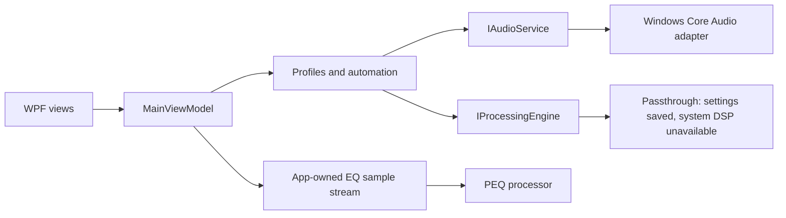

# AudioFlow

A native Windows audio controller built with C# and .NET 8 WPF.

AudioFlow brings per-app volume, output devices, saved listening profiles, and automation into one desktop app. Its equalizer opens with eleven editable bands and an app-owned musical sample for comparing EQ changes.

> **Development prototype · v0.2.21**
> Mixer controls change Windows audio levels. EQ processes only AudioFlow's own preview sample.
> **The DSP chain is not connected to live system audio from Spotify, games, or other applications.**
> System-wide EQ, Equalizer APO integration, and HRTF surround remain planned.

## What works today

| Area | Implemented behavior |
| --- | --- |
| Mixer | Enumerates Windows audio sessions; per-app volume/mute and master volume/mute |
| Devices | Lists active outputs and changes the default output through a prototype Windows adapter |
| Profiles | Saves output selection, app volumes, and processing settings |
| Automation | Ordered app/process and device rules; first matching rule wins |
| Equalizer | Eleven initial bands, expandable to 31; frequency, Q, filter type, gain, and bypass |
| Preview | Looping stereo sample with real-time EQ changes and original/processed comparison |
| Desktop | Tray operation, single-instance activation, optional startup |
| Persistence | Versioned JSON settings, atomic writes, backup and corrupt-file preservation |

A saved processing configuration does not mean it is audible. Compressor, limiter, and crossfeed settings remain in the data model for compatibility; the simplified EQ preview does not apply them. The preview output cap is not a production limiter.

## Build and run

Use Windows 10 build 19041 or newer (or Windows 11), and a **.NET 8 SDK** with desktop targeting support. Visual Studio 2022 with the .NET desktop workload is optional. No external NuGet libraries are referenced by the current projects.

```powershell
dotnet restore AudioFlow.csproj --configfile tests/NuGet.Config
dotnet build AudioFlow.csproj -c Release --no-restore
dotnet run --project AudioFlow.csproj -c Release --no-build
```

The app can change real volume and output selection; use a comfortable playback level when trying profiles. Closing the window keeps AudioFlow in the tray. Exit from the tray to quit.

Portable settings: `%LOCALAPPDATA%\AudioFlow\settings.json`; logs: `%LOCALAPPDATA%\AudioFlow\Logs`. Packaged data behavior needs validation for each deployment.

## Verification

Run the checked-in executable regression suite on Windows:

```powershell
dotnet restore tests/Regression/Regression.csproj --configfile tests/NuGet.Config
dotnet build tests/Regression/Regression.csproj -c Release --no-restore
dotnet tests/Regression/bin/Release/net8.0-windows/Regression.dll
powershell -NoProfile -File installer/Sync-Version.ps1 -Check
```

The runner uses fake audio/startup services and isolated settings. It covers profiles, automation, persistence/recovery, UI bindings, lifecycle notifications, PEQ signal behavior, and the app-owned preview pipeline. It is an executable runner, so `dotnet test` alone does not execute these checks.

CI runs the Release build, version synchronization check, and offline regression runner on Windows. Passing CI does not establish real hardware behavior or Microsoft Store certification. See [verification evidence](docs/VERIFICATION.md) and the [hardware checklist](tests/Hardware-checklist.md). Opt-in output smoke checks are described in [tests/README.md](tests/README.md); they play sound and are excluded from CI.

## Architecture



Windows interop sits outside the UI. Profiles and ordered rules operate through service interfaces, while `PeqProcessor` accepts interleaved floating-point samples. Device/master callbacks are debounced; session discovery and automation have a five-second polling fallback. See [architecture and implementation limits](docs/ARCHITECTURE.md).

## Current limits

- Default-output switching uses undocumented Windows PolicyConfig interfaces and needs compatibility testing.
- New audio sessions can take up to five seconds to appear.
- USB/Bluetooth reconnects, sleep/resume, and output changes during preview need physical-device testing.
- System-wide DSP, production WASAPI output, and original/licensed HRTF processing are future work.
- The MSIX manifest uses a development identity. Local package tests are not Store certification.
- No Dolby Atmos, DTS, Equalizer APO, HeSuVi binaries, or proprietary impulse responses are bundled.
- No payments or Free/Pro feature locks are implemented.

## Packaging

For a self-contained x64 build:

```powershell
dotnet publish AudioFlow.csproj -c Release -r win-x64 --self-contained true -o publish/win-x64
```

Use Inno Setup 6 with `installer/AudioFlow.iss`, or follow the [MSIX packaging guide](packaging/README.md). Signing keys, certificates, installers, local backups, and generated packages are excluded from source control. This repository publishes source; it does not promise a signed end-user release.

## Project direction and community

Development priorities: working functionality, reliability, then visual refinement. See the [roadmap](ROADMAP.md), [contributing guide](CONTRIBUTING.md), [security policy](SECURITY.md), and [code of conduct](CODE_OF_CONDUCT.md). Roadmap entries are intentions without delivery dates.

AudioFlow is an independent project. This repository makes no claim of affiliation with Kiro, AWS, Microsoft, Dolby, or DTS.

## License and acknowledgments

[MIT](LICENSE), copyright 2026 Lakshya Sahu and AudioFlow contributors.
The PEQ coefficient equations follow the [W3C Audio EQ Cookbook](https://www.w3.org/TR/audio-eq-cookbook/). See [third-party notices](THIRD_PARTY_NOTICES.md).
